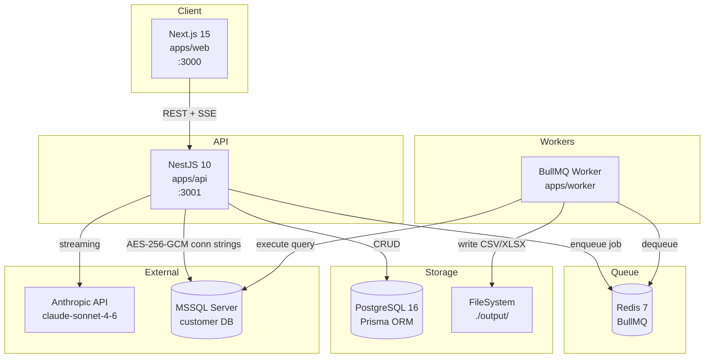
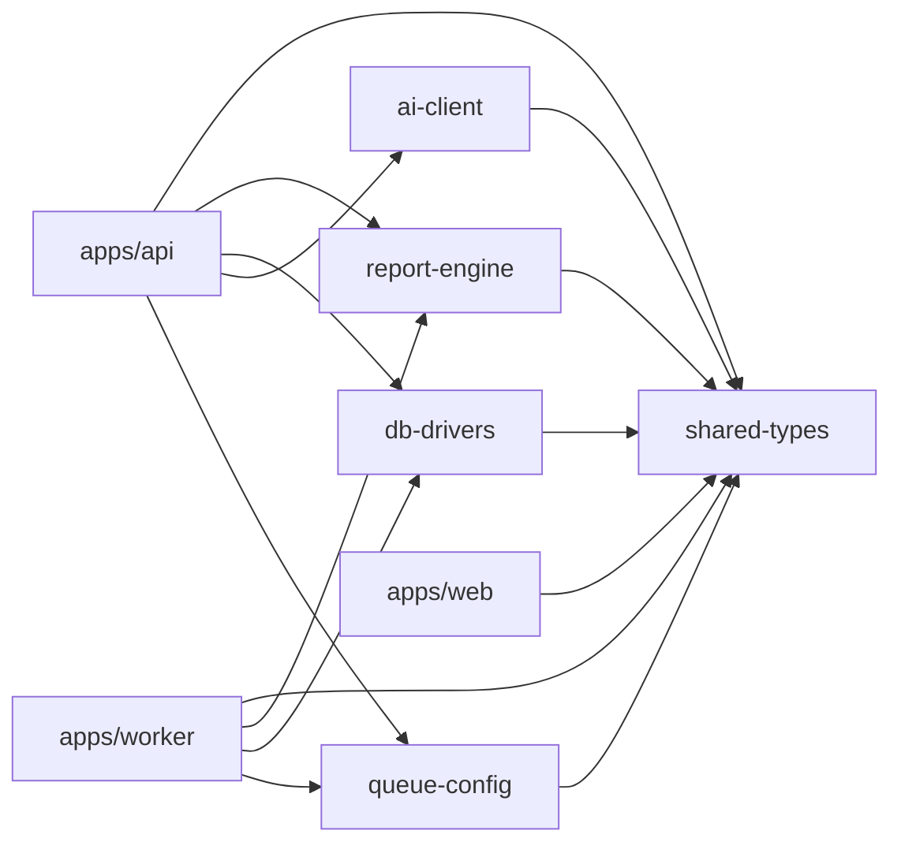
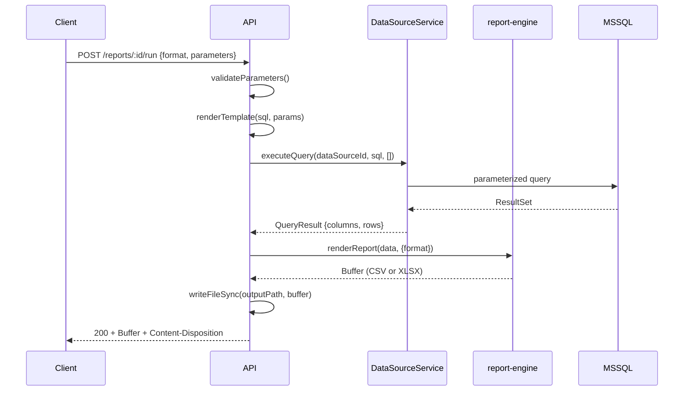
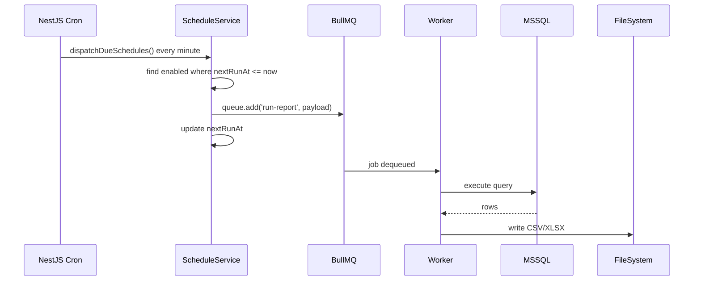
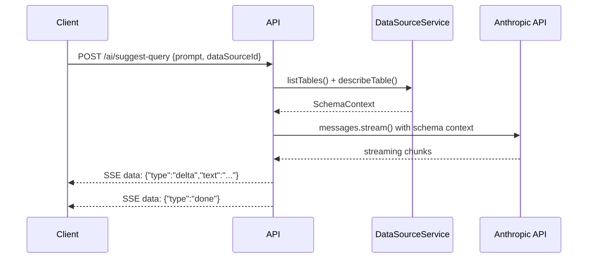

# DataScriba — System Architecture

## Overview

DataScriba follows a monorepo structure (Turborepo + pnpm workspaces) with three deployable
applications and five shared packages.

## System Diagram



## Package Dependency Graph



## Data Flow — Synchronous Report Execution



## Data Flow — Scheduled Report (Async)



## Data Flow — AI SQL Suggestion (Streaming SSE)



## Security Model

| Concern | Mechanism |
|---------|-----------|
| Connection string storage | AES-256-GCM, key from `ENCRYPTION_MASTER_KEY` env |
| Mutation prevention | `assertQueryAllowed()` blocks DROP/DELETE/TRUNCATE |
| SQL injection | Parameterized queries at driver level |
| AI rate limiting | ThrottlerModule (configurable RPM per IP) |
| Response sanitization | `encryptedConnectionString` always redacted in API responses |

## NestJS Module Structure

```
src/
├── modules/
│   ├── data-source/    CRUD + connection management
│   ├── report/         CRUD + synchronous run
│   ├── schedule/       CRUD + cron dispatch + manual trigger
│   └── ai/             SSE streaming + explain endpoint
├── health/             GET /health
├── common/filters/     AppExceptionFilter (global)
└── config/env.ts       Zod-validated environment
```
